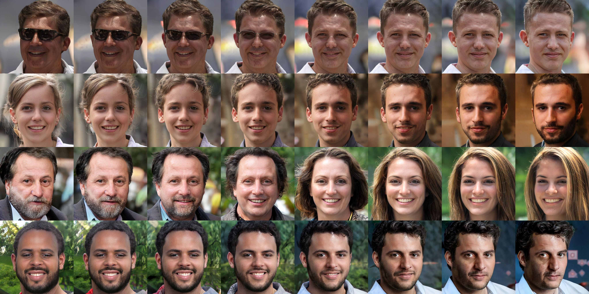

# StyleSwin

This repo is the official implementation of "[StyleSwin: Transformer-based GAN for High-resolution Image Generation]()".

By [Bowen Zhang](http://home.ustc.edu.cn/~zhangbowen), [Shuyang Gu](http://home.ustc.edu.cn/~gsy777/), [Bo Zhang](https://bo-zhang.me/), [Jianmin Bao](https://jianminbao.github.io/), [Dong Chen](http://www.dongchen.pro/), [Fang Wen](https://www.microsoft.com/en-us/research/people/fangwen/), [Yong Wang](https://auto.ustc.edu.cn/2021/0510/c25976a484888/page.htm) and [Baining Guo](microsoft.com/en-us/research/people/bainguo/).

Code and pretrained models will be released soon. Please stay tuned.

## Abstract

> Despite the tantalizing success in a broad of vision tasks, transformers have not yet demonstrated on-par ability as ConvNets in high-resolution image generative modeling. In this paper, we seek to explore using pure transformers to build a generative adversarial network for high-resolution image synthesis. To this end, we believe that local attention is crucial to strike the balance between computational efficiency and modeling capacity. Hence, the proposed generator adopts Swin transformer in a style-based architecture. To achieve a larger receptive field, we propose double attention which simultaneously leverages the context of the local and the shifted windows, leading to improved generation quality. Moreover, we show that offering the knowledge of the absolute position that has been lost in window-based transformers greatly benefits the generation quality. The proposed StyleSwin is scalable to high resolutions, with both the coarse geometry and fine structures benefit from the strong expressivity of transformers. However, blocking artifacts occur during high-resolution synthesis because performing the local attention in a block-wise manner may break the spatial coherency. To solve this, we empirically investigate various solutions, among which we find that employing a wavelet discriminator to examine the spectral discrepancy effectively suppresses the artifacts. Extensive experiments show the superiority over prior transformer-based GANs, especially on high resolutions, e.g., $1024\times 1024$. The StyleSwin, without complex training strategies, excels over StyleGAN on CelebA-HQ $1024$, and achieves on-par performance on FFHQ-$1024$, proving the promise of using transformers for high-resolution image generation.

## Main Results

### Quantitative Results

| Dataset | Resolution | FID | Pretrained Model |
| :-: | :-: | :-: | :-: |
| FFHQ | 256x256 | 2.81 | - |
| LSUN Church | 256x256 | 3.10 | - |
| CelebA-HQ | 256x256 | 3.25 | - |
| FFHQ | 1024x1024 | 5.07 | - |
| CelebA-HQ | 1024x1024 | 4.43 | - |

### Qualitative Results

Image samples of FFHQ-1024 generated by StyleSwin:

Image samples of CelebA-HQ 1024 generated by StyleSwin:

Latent code interpolation examples of FFHQ-1024 between the left-most and the right-most images:

## Maintenance

This project is currently maintained by Bowen Zhang. If you have any questions, feel free to contact [zhangbowen@mail.ustc.edu.cn](zhangbowen@mail.ustc.edu.cn) or [zhanbo@microsoft.com](zhanbo@microsoft.com).

## License
The codes and the pretrained model in this repository are under the MIT license as specified by the LICENSE file. We use our labeled dataset to train the scratch detection model.

This project has adopted the [Microsoft Open Source Code of Conduct](https://opensource.microsoft.com/codeofconduct/). For more information see the [Code of Conduct FAQ](https://opensource.microsoft.com/codeofconduct/faq/) or contact [opencode@microsoft.com](mailto:opencode@microsoft.com) with any additional questions or comments.
